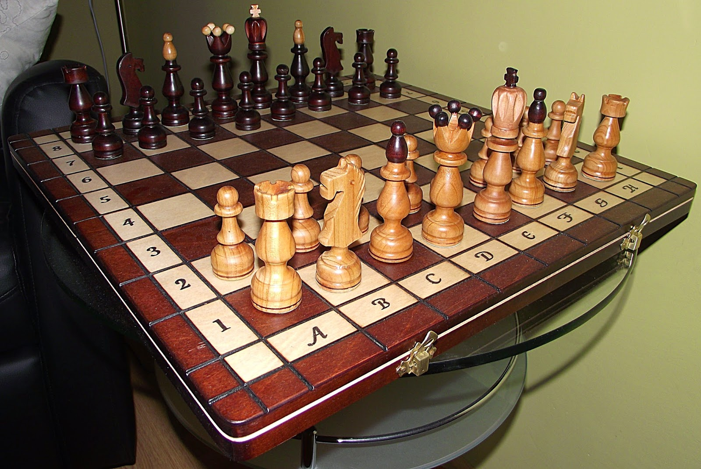

Wstęp
=========================

Szachy, są gra która pierwszy raz pojawiła się około VI wieku w Indiach gdzie początkowo była znana jako "chaturanga".
W ciągu następnych lat zyskała ogromną popularność w Persji, a następnie rozprzestrzeniła sie po całej Europie.
W pewnym momencie szachy które były uważane za zwykłą grę stały się czymś większym, symbolem strategii i taktyki.

   Szachy
